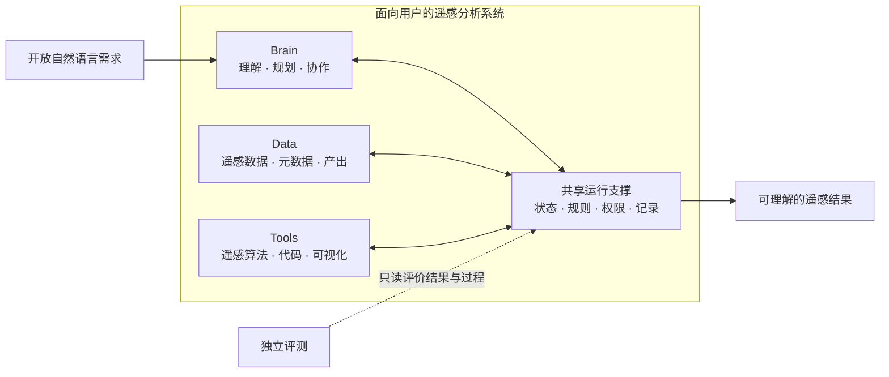
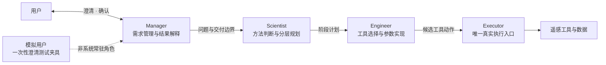
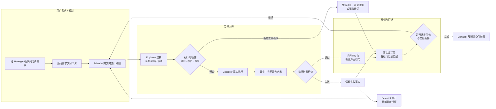

# 第一章模块连续性与控制图

> 目标：现代化 ExpertsRS，但不抛弃已发表论文的 User-centric RS 与 `Data–Tools–Brain` 思想母体。

## 一句话主线

> 面向非遥感专业用户的开放式城市森林分析需求，构建能够保持用户意图、组织专业数据与工具，
> 并根据运行反馈可靠完成任务的多智能体遥感工作流。

“可靠”在本章中具体指需求保持性、执行有效性、反馈适应性和结果可核验性，而不是未经大规模
重复实验支持的统计稳定性。这是已发表 User-centric RS 理念的可靠性升级，不是换一个系统故事。
这里的运行时（runtime）是
`Data–Tools–Brain` 之间共享的运行控制与证据外壳，不是第四个论文概念模块、Engineer 私有
工具或新的审核 Agent。

## 阶段命名

- **URSA/ExpertsRS prototype**：已发表的 conversation-oriented 多智能体原型，主要由 StateFlow 与
  对话历史隐式组织执行；
- **URSA Harness（v0.5.3）**：当前 domain-specific、evidence-first research harness；具有统一
  run/resume、typed workflow、受控 Executor、运行事实、两类图、交付闭合和独立评测；
- **未来 production/general harness**：只有补齐进程沙箱、durable session、通用 plugin/profile、
  外部能力生态和运维面后才可讨论，当前不得省略限定词。

因此论文正文优先使用“URSA 领域智能体运行时”或“面向遥感工作流的研究型 Agent Harness”；
PPT/面试可使用 `URSA Harness` 作为升级阶段名，但必须同时说明它不是通用或生产级 Harness。
代码 package 暂不因叙事命名而重命名，避免破坏 API、工件路径和历史证据连续性。

## 模块继承关系

| 论文母体 | 原论文中的作用 | 近期升级主要内容 | 章节地位 | 不应承担的 claim |
| --- | --- | --- | --- | --- |
| `Data` | 遥感数据及补充信息，为任务提供观测对象 | 动态数据发现、元数据、真实工具反馈、带版本产出；本地 Sentinel-2 小样 | 受控输入、环境反馈与真实任务载体 | 当前没有形成新的数据方法；不能用单场景证明泛化 |
| `Tools` | 算法、代码和可视化能力，供 Engineer 完成分析 | 4 类工具包、18 个注册工具、统一输入输出、错误处理和工具约定 | 必要工程基础和工具语义入口 | 工具数量、注册表和函数调用本身不是科学创新 |
| `Brain` | Manager–Scientist–Engineer 的任务理解、方法设计和协作 | 最小任务意图、可调整的分层规划、ReAct 动作—反馈—修订循环 | 方法自主性和动态规划的承载层 | 不要求 Scientist 一次填满静态图；角色数量、ReAct 或提示词本身不列为创新 |
| 运行时外壳 | 原论文主要由 StateFlow/对话历史隐式承担 | 共享运行状态、唯一执行入口、预算、规则和权限检查、运行记录、planned/observed graph、检查点/停止接口 | 连接 Brain、Tools、Data 并形成可检查运行边界 | v0.5.3 已实现运行内逻辑恢复和应用层权限围栏；不等于进程沙箱、durable recovery、远程执行或通用 Harness |
| 独立评测 | 两案例与 20 条任务轻量评测 | 单元/集成测试、诊断记录、未来同任务对照实验 | 位于系统外部，判断机制是否成立 | 不和系统内部规则检查混为同一“验证模块” |

## 工程实现策略：有边界的插件化

> 2026-09-10 实现状态补注：下表包含设计方向。实际已有 DecisionProvider 与知识协议（后者 unavailable）；ExecutionBackend、EventStore、ScientificConstraintProvider、TelemetrySink 及 SQLite/远程适配器尚未实现。运行时仍直接使用 LocalToolExecutor 和 JSON/JSONL。当前实际能力见 [面试与架构说明](research_agent_interview_20260910.md)。

当前采用 **stable domain kernel + replaceable capability ports + external evaluation**，而不是把全部
系统对象做成可替换插件。该策略借鉴 DeepSeek Harness/Cordis 的 capability seam、typed event、
profile composition 和可替换 provider 思想，但保留研究系统必须稳定的事实与成功语义。

| 层 | 内容 | 可替换性 |
| --- | --- | --- |
| Domain kernel | typed workflow、validator、eligible-node、delivery obligations、终态、provenance、两类图和隐私不变量 | 只能版本化演进，不允许 profile 静默替换 |
| Capability ports | DecisionProvider、ExecutionBackend、EventStore、ScientificConstraintProvider、TelemetrySink | 可通过显式 adapter/provider 替换 |
| Adapters | AutoGen/direct model、local/subprocess/remote execution、JSONL/SQLite、Chapter 2 knowledge | 必须声明版本、能力、权限和错误映射 |
| External evaluation | gold、fault ledger、grader、人工校准和 claim 判定 | 位于系统外，不进入插件 context 或 Agent 输入 |

近期只用 Python `Protocol + dependency injection + explicit registry/profile`，不实现 Cordis clone、动态
发现或热卸载。直接移植 Cordis-bound TypeScript agent loop/session/tool packages 的收益低于跨语言和
生命周期成本；未来若需要真实进程隔离，可优先把 DeepSeek Harness 的 sandbox/subprocess 能力作为
外部 `ExecutionBackend` 做 parity 原型。正式决定见
`architecture_decisions/ADR-003-bounded-plugin-harness-adoption.md`。

## 既有范式图与第一章最小三图

已发表 URSA 的范式转换图 `assets/img/1Paradgim_trans_00.jpg` 用于 Introduction：它回答为什么要从
以数据/产品供给为起点的分析方式转向以用户实际需求为起点的遥感分析。它属于**历史思想母体**，
不作为 v0.5.3 当前系统架构图，也不计入下面三张新增方法图。

第一章只维护三张架构图。它们分别回答“系统由什么构成”“角色各自负责什么”“一次任务怎样
运行和恢复”，不能相互替代，也不再增加第四张总架构图。

### CH1-FIG-01：系统模块概念图

唯一用途：解释原论文 `Data–Tools–Brain` 如何被现代化。共享运行支撑不是第四个论文概念
模块；独立评测位于被测系统之外。Brain 提出数据与工具使用意图，运行时负责约束、绑定并落实为
对 Data 与 Tools 的真实操作；不增加 Brain 到 Data/Tools 的执行直连箭头。

### CH1-FIG-02：多智能体角色与责任图

唯一用途：解释职责和权限。Manager 决定何时询问用户，Scientist 负责方法，Engineer 负责实现，
Executor 负责真实执行；运行时和审核器都不是新的 Agent。为保持责任图简洁，工具反馈、方法修订和
结果回传统一放在 `CH1-FIG-03`，不在本图重复画闭环。

### CH1-FIG-03：规划—执行—反馈—恢复闭环

唯一用途：解释第一章新增方法。规划面向未来，过程图面向已发生事实，检查点支持从最近安全
位置继续。过程图可以把当前相关信息反馈给 Scientist，但不代替 Scientist 规划。

### 三图维护规则

1. 本文件中的 Mermaid 是三张图的唯一可编辑来源；论文和 PPT 从这里派生，不另存内容不同的
   “最新版架构图”；
2. `CH1-FIG-01` 只在模块边界变化时更新；`CH1-FIG-02` 只在角色责任变化时更新；
   `CH1-FIG-03` 只在运行语义、检查点或反馈闭环变化时更新；
3. 图中只使用稳定中文概念。代码类名、JSON 字段和具体框架只进入图注或技术附录；
4. 未实现部分必须在使用时标注证据状态。v0.5.3 后，`CH1-FIG-03` 有 scripted/live 小样和最终
   5×3 工件支撑，但仍是方法机制图，不是一般效果、科学准确性或生产系统证明；
5. 其他图只允许解释实验条件、数据或结果，不再承担“总体架构图”的职责。

### 统一视觉表达规范

- 图内以中文概念为主，英文术语只在首次图注中给出；不出现 Python 类名、JSON 字段、框架或模型
  Logo；
- 实线表示控制流或数据流，虚线只表示外部评测、测试夹具或只读关系；同一类箭头保持相同语义；
- 使用低饱和蓝、青绿、橙、紫灰和中性灰区分 Brain、Data、Tools、运行支撑与外部评测；不使用
  渐变、阴影或把 controlled stop/clarification 画成红色失败；
- 图展示机制，不在节点中直接写“安全”“可靠”“智能”等结论性形容词；
- `ProfiledUserAgent` 只能作为隔离测试夹具出现，task-11 只能标注局部重新授权，不能画成规划质量
  提升或通用自动恢复。

论文结果部分只再补两张非架构图：`CH1-EXP-FIG-01` 为 5 任务 × 3 条件的协议终态矩阵，
`CH1-EXP-FIG-02` 为 task-11 的 Scientist—Engineer/Executor—runtime/evidence—Manager 四泳道证据
时间线。前者展示 15/15 evaluator closure 及 5/7/3 终态分布，不命名为准确率或成功率；后者标明
`local_reauthorization_only`，不宣称生成了更优规划。

| 图号 | 主要对应的可追溯结论 |
| --- | --- |
| `CH1-FIG-01` | `C1-ARCH-01`：Data–Tools–Brain 连续性与共享运行支撑 |
| `CH1-FIG-02` | `C1-ARCH-01`、`C1-CTRL-02`：角色责任与唯一执行入口 |
| `CH1-FIG-03` | `C1-DESIGN-01/02/03`、`C1-CTRL-01/02`：三个研究对象及检查/权限支撑 |

### 与原 StateFlow 的关系

原 StateFlow 用四个对话状态和 `speaker_selection` 决定下一位发言者：澄清需求、定义问题、
解决问题、生成报告。`CH1-FIG-03` 在论文叙事上取代它成为升级后系统的**运行机制图**：保留
Manager 的澄清/报告外层，把原来笼统的“定义—解决”展开为可调整规划、真实工具反馈、过程图
和检查点恢复。

在工程事实上，StateFlow 仍是已发表系统和 notebook 的历史复现基线；v0.5.3 的
`ExpertsRSSystem.run()` / `.resume()` 已成为新系统 scripted/live 的唯一权威入口。最准确的表述是：
**新闭环已经在独立 package 中实现并形成证据，旧 notebook 只作为历史基线和复现入口保留。**

### 规划与图的关系

- 当前计划是 Scientist 对未来路径的暂定判断；
- 实际动作、工具反馈和产出是已经发生、不可事后覆盖的运行事实；
- 过程图把计划、事实、修改和替代路径逐步连接起来，既不是一次性先验计划，也不是没有关系的普通日志；
- 失败时从检查点形成替代路径，保留已验证产出；当前只承诺逻辑恢复，不承诺任意
  外部副作用的物理撤销。

### 为什么不默认增加审核 Agent

审核需求存在，但“审核功能”不等于“新增角色”。计划和结果分别经过四种责任互补的检查：

1. Manager 检查用户意图、澄清和需要人工确认的高风险选择；
2. Scientist/Engineer 分别对方法与工具实现负责，并根据真实工具反馈修订，而不是把责任
   转交给一个通用审核器；
3. 运行时使用固定规则检查工具约定、权限、预算、产出完整性和停止条件；
4. 独立评测评价过程和最终结果，不把标准答案回流到被测系统。

可选的模型审核器只处理固定规则无法判断的语义问题，按明确条件临时调用、没有工具执行权限、
只输出带依据的建议。这样避免审核器与规划者共享同类模型错误、无限互审、成本上升和最终
决策权不清。它未来可以作为实验对照，而不是当前系统常驻 Agent。

### 最小权限控制面

角色分工只表达职责，不能自动形成权限。运行时还要在真正执行前回答“谁可以对什么资源做
哪类动作”，并由 Executor 统一执行。D1 只冻结这个接口；D2 才实现本地允许、拒绝或要求
确认。云端身份系统、密钥、容器隔离、跨系统协议与多租户属于章节后的生产待办。

## 近期升级到底属于哪些模块

按主要工作量和研究意义分组：

1. **工具工程升级**：18 个工具、注册和输入输出约定、结构化结果、工具测试；
2. **Brain 规划升级**：从一次性自然语言方案走向可调整的总体、阶段和下一动作规划；
3. **Brain 协作升级**：ReAct 动作—反馈—修订循环、选择与执行分离、预算；
4. **运行表示升级**：把计划、决定、调用、反馈、产出、修改、检查点和替代路径组织成随执行更新的过程图；
5. **工程质量升级**：单元、回归、集成冒烟、收口脚本和独立审计；
6. **科学评测设计**：把原 20 条任务的可行性评测与未来机制对照实验分开。

其中第 2--4 项共同构成当前冻结的三个研究对象：可调整的分层规划、随执行更新的过程图和
基于检查点的局部恢复。ReAct、图、运行记录和检查点分别都有已有工作，不能独立包装成
创新点；第 6 项决定这一组合能否从“设计已冻结”升级为“效果得到支持”。

## Runtime 叙事的强弱版本

### 当前可以说

> 已发表的面向用户自然语言遥感流程仍是思想母体；v0.5.3 已把类型化 planned graph、节点约束
> 执行、真实工具 observation、Scientist 局部重新授权、observed graph、运行内 checkpoint 和
> runtime-owned delivery closure 接入统一 scripted/live runtime，并在冻结条件下完成 15/15 v2 closure。

### 当前不能说

> 已证明规划优越性、checkpoint 独立效应、跨任务/跨传感器泛化、长期记忆或自我反思学习；
> 已完成进程沙箱、崩溃后 durable recovery、通用插件生态或生产级多智能体 Harness。

当前 task-11 只支持 observation 后的 `local_reauthorization_only`，不证明生成了新的更优规划路径；
最终 5×3 是开题级集成与协议闭合证据，不是稳定效果、主题精度或外部有效性实验。

## 控制研究不失控的三条规则

1. **一个章节只保留一个核心因果问题**：本章自适应方法相比旧对话流程与静态预先规划，
   是否更容易执行完成、从失败中恢复并接受追溯检查；
2. **一个功能只占一个层级**：ReAct、registry、checkpoint、trace writer 是支撑机制，除非有独立实验，否则不晋级为创新点；
3. **一个“成功”必须标明验证层级**：单测通过、工具运行、历史轻量评测和同任务效果对照是四种不同证据。

## 三章的验证责任边界

| 章节 | 回答的问题 | 保留的检查内容 | 不负责什么 | 向下一章提供什么 |
| --- | --- | --- | --- | --- |
| 第一章：工作流构建与运行 | 系统能否安全、完整、可追溯地执行并从操作失败继续？ | 文件/类型/顺序、工具签名、权限、预算、产出完整性、停止条件；波段标识、nodata 计数、CRS/grid 等任何正确工具执行都必须满足的底线不变量 | 不判断 NDVI 是否适合某个科学问题，不校准阈值，不证明结论科学有效 | 可修改计划、工具动作、运行记录、过程图、检查点与失败状态 |
| 第二章：科学约束 | 当前方法和结论是否有知识与证据依据？ | 方法适用条件、传感器语义、阈值/样本/参考数据要求、不确定性、证据充分性、冲突和结论降级 | 不重新实现运行记录、检查点、权限或分支管理 | `修改计划 / 增加验证 / 询问 / 拒绝 / 降级` 等有依据的行动义务 |
| 第三章：独立系统评测 | 完整系统在真实任务和用户层面是否更可靠、更有用？ | 结果、轨迹、故障恢复、成本、人工介入和用户效用的独立评分 | 不参与被测运行，不把标准答案回流，不重复实现第一、二章机制 | 跨方法结果、错误分析和外部有效性证据 |

最容易混淆的是“失败后修改计划”。第二章可以发现**为什么科学上必须修改**，并输出修改、
补验证、询问或拒绝；第一章负责**怎样在运行中执行这个决定**，包括保留记录、选择检查点、
复用有效产出和形成替代路径。因此第二章会使用第一章的局部恢复接口，但不拥有另一套恢复
实现。

第一章中已经编码的波段、nodata、CRS 和 grid 检查只保留“工具若要诚实执行就必须满足”的
最小底线。任何随任务、研究假设或证据强度变化的科学判断都移交第二章。这保证第一章是整体
系统方法章，却不会吞掉科学约束与独立系统评测的研究空间。
