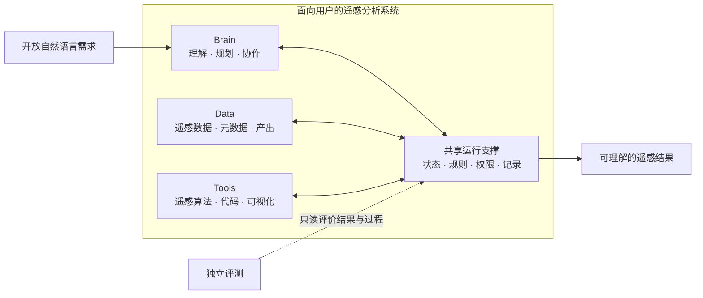
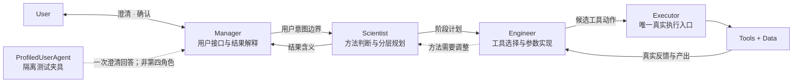
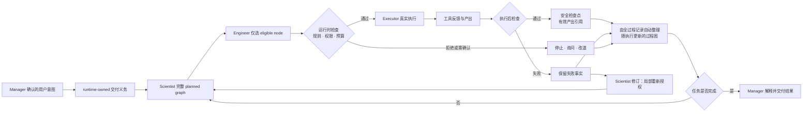

# 第一章模块连续性与控制图

> 目标：现代化 ExpertsRS，但不抛弃已发表论文的 User-centric RS 与 `Data–Tools–Brain` 思想母体。

## 一句话主线

> 面向用户的多智能体遥感分析系统，将开放自然语言需求转化为可随真实工具反馈动态调整、
> 可恢复并可追溯的分析过程，最终交付用户可理解的遥感结果。

这是已发表 User-centric RS 理念的可靠性升级，不是换一个系统故事。这里的运行时（runtime）是
`Data–Tools–Brain` 之间共享的运行控制与证据外壳，不是第四个论文概念模块、Engineer 私有
工具或新的审核 Agent。

## 模块继承关系

| 论文母体 | 原论文中的作用 | 近期升级主要内容 | 章节地位 | 不应承担的 claim |
| --- | --- | --- | --- | --- |
| `Data` | 遥感数据及补充信息，为任务提供观测对象 | 动态数据发现、元数据、真实工具反馈、带版本产出；本地 Sentinel-2 小样 | 受控输入、环境反馈与真实任务载体 | 当前没有形成新的数据方法；不能用单场景证明泛化 |
| `Tools` | 算法、代码和可视化能力，供 Engineer 完成分析 | 4 类工具包、18 个注册工具、统一输入输出、错误处理和工具约定 | 必要工程基础和工具语义入口 | 工具数量、注册表和函数调用本身不是科学创新 |
| `Brain` | Manager–Scientist–Engineer 的任务理解、方法设计和协作 | 最小任务意图、可调整的分层规划、ReAct 动作—反馈—修订循环 | 方法自主性和动态规划的承载层 | 不要求 Scientist 一次填满静态图；角色数量、ReAct 或提示词本身不列为创新 |
| 运行时外壳 | 原论文主要由 StateFlow/对话历史隐式承担 | 共享运行状态、唯一执行入口、预算、规则和权限检查、运行记录、过程图、检查点/停止接口 | 连接 Brain、Tools、Data 并形成可检查运行边界 | 当前只实现分离的静态内核、部分规则检查和 ReAct 记录；统一权限检查、过程图和局部恢复未实现 |
| 独立评测 | 两案例与 20 条任务轻量评测 | 单元/集成测试、诊断记录、未来同任务对照实验 | 位于系统外部，判断机制是否成立 | 不和系统内部规则检查混为同一“验证模块” |

## 第一章最小三图

第一章只维护三张架构图。它们分别回答“系统由什么构成”“角色各自负责什么”“一次任务怎样
运行和恢复”，不能相互替代，也不再增加第四张总架构图。

### CH1-FIG-01：系统模块概念图

唯一用途：解释原论文 `Data–Tools–Brain` 如何被现代化。共享运行支撑不是第四个论文概念
模块；独立评测位于被测系统之外。

### CH1-FIG-02：多智能体角色与责任图

唯一用途：解释职责和权限。Manager 决定何时询问用户，Scientist 负责方法，Engineer 负责实现，
Executor 负责真实执行；运行时和审核器都不是新的 Agent。

### CH1-FIG-03：规划—执行—反馈—恢复闭环

唯一用途：解释第一章新增方法。规划面向未来，过程图面向已发生事实，检查点支持从最近安全
位置继续。过程图可以把当前相关信息反馈给 Scientist，但不代替 Scientist 规划。

### 三图维护规则

1. 本文件中的 Mermaid 是三张图的唯一可编辑来源；论文和 PPT 从这里派生，不另存内容不同的
   “最新版架构图”；
2. `CH1-FIG-01` 只在模块边界变化时更新；`CH1-FIG-02` 只在角色责任变化时更新；
   `CH1-FIG-03` 只在运行语义、检查点或反馈闭环变化时更新；
3. 图中只使用稳定中文概念。代码类名、JSON 字段和具体框架只进入图注或技术附录；
4. 未实现部分必须在使用时标注证据状态。D2 后，`CH1-FIG-03` 有无 API 小样支撑，但仍是
   方法机制图，不是 live-LLM 系统截图；
5. 其他图只允许解释实验条件、数据或结果，不再承担“总体架构图”的职责。

| 图号 | 主要对应的可追溯结论 |
| --- | --- |
| `CH1-FIG-01` | `C1-ARCH-01`：Data–Tools–Brain 连续性与共享运行支撑 |
| `CH1-FIG-02` | `C1-ARCH-01`、`C1-CTRL-02`：角色责任与唯一执行入口 |
| `CH1-FIG-03` | `C1-DESIGN-01/02/03`、`C1-CTRL-01/02`：三个研究对象及检查/权限支撑 |

### 与原 StateFlow 的关系

原 StateFlow 用四个对话状态和 `speaker_selection` 决定下一位发言者：澄清需求、定义问题、
解决问题、生成报告。`CH1-FIG-03` 在论文叙事上取代它成为升级后系统的**运行机制图**：保留
Manager 的澄清/报告外层，把原来笼统的“定义—解决”展开为可调整规划、真实工具反馈、过程图
和检查点恢复。

但在工程事实上，StateFlow 仍是已发表系统和当前 notebook 的历史基线；D2 只在独立无 API
路径中贯通新闭环，尚未替换 notebook 的 live-LLM 路由。最准确的表述是：**叙事上由新闭环
承接，代码上作为基线和兼容入口保留。**

### 规划与图的关系

- 当前计划是 Scientist 对未来路径的暂定判断；
- 实际动作、工具反馈和产出是已经发生、不可事后覆盖的运行事实；
- 过程图把计划、事实、修改和替代路径逐步连接起来，既不是一次性先验计划，也不是没有关系的普通日志；
- 失败时从检查点形成替代路径，保留已验证产出；当前只承诺逻辑恢复，不承诺任意
  外部副作用的物理撤销。

### 为什么不默认增加审核 Agent

审核需求存在，但“审核功能”不等于“新增角色”。计划和结果分别经过四种责任互补的检查：

1. Manager 检查用户意图、澄清和需要人工确认的高风险选择；
2. Scientist/Engineer 分别对方法与工具实现负责，并根据真实工具反馈修订，而不是把责任
   转交给一个通用审核器；
3. 运行时使用固定规则检查工具约定、权限、预算、产出完整性和停止条件；
4. 独立评测评价过程和最终结果，不把标准答案回流到被测系统。

可选的模型审核器只处理固定规则无法判断的语义问题，按明确条件临时调用、没有工具执行权限、
只输出带依据的建议。这样避免审核器与规划者共享同类模型错误、无限互审、成本上升和最终
决策权不清。它未来可以作为实验对照，而不是当前系统常驻 Agent。

### 最小权限控制面

角色分工只表达职责，不能自动形成权限。运行时还要在真正执行前回答“谁可以对什么资源做
哪类动作”，并由 Executor 统一执行。D1 只冻结这个接口；D2 才实现本地允许、拒绝或要求
确认。云端身份系统、密钥、容器隔离、跨系统协议与多租户属于章节后的生产待办。

## 近期升级到底属于哪些模块

按主要工作量和研究意义分组：

1. **工具工程升级**：18 个工具、注册和输入输出约定、结构化结果、工具测试；
2. **Brain 规划升级**：从一次性自然语言方案走向可调整的总体、阶段和下一动作规划；
3. **Brain 协作升级**：ReAct 动作—反馈—修订循环、选择与执行分离、预算；
4. **运行表示升级**：把计划、决定、调用、反馈、产出、修改、检查点和替代路径组织成随执行更新的过程图；
5. **工程质量升级**：单元、回归、集成冒烟、收口脚本和独立审计；
6. **科学评测设计**：把原 20 条任务的可行性评测与未来机制对照实验分开。

其中第 2--4 项共同构成当前冻结的三个研究对象：可调整的分层规划、随执行更新的过程图和
基于检查点的局部恢复。ReAct、图、运行记录和检查点分别都有已有工作，不能独立包装成
创新点；第 6 项决定这一组合能否从“设计已冻结”升级为“效果得到支持”。

## Runtime 叙事的强弱版本

### 当前可以说

> 已发表的面向用户自然语言遥感流程仍是思想母体；当前已经分别实现带明确类型的静态工作流
> 与规则检查，以及 ReAct 工具反馈循环，并冻结了把二者收束为“根据真实反馈调整计划、记录
> 过程并从局部失败恢复”的方法方向。

### 当前不能说

> 已经完成计划版本、随执行更新的过程图、检查点替代路径、自我反思学习或统一的持久化
> 多智能体运行时。

原因是带明确类型的工作流与真实模型 ReAct 仍是平行路径。波段和 nodata 等最小科学前置条件
已通过单个小样测试，但尚未覆盖真实模型规划、跨传感器语义或效果实验。

## 控制研究不失控的三条规则

1. **一个章节只保留一个核心因果问题**：本章自适应方法相比旧对话流程与静态预先规划，
   是否更容易执行完成、从失败中恢复并接受追溯检查；
2. **一个功能只占一个层级**：ReAct、registry、checkpoint、trace writer 是支撑机制，除非有独立实验，否则不晋级为创新点；
3. **一个“成功”必须标明验证层级**：单测通过、工具运行、历史轻量评测和同任务效果对照是四种不同证据。

## 三章的验证责任边界

| 章节 | 回答的问题 | 保留的检查内容 | 不负责什么 | 向下一章提供什么 |
| --- | --- | --- | --- | --- |
| 第一章：工作流构建与运行 | 系统能否安全、完整、可追溯地执行并从操作失败继续？ | 文件/类型/顺序、工具签名、权限、预算、产出完整性、停止条件；波段标识、nodata 计数、CRS/grid 等任何正确工具执行都必须满足的底线不变量 | 不判断 NDVI 是否适合某个科学问题，不校准阈值，不证明结论科学有效 | 可修改计划、工具动作、运行记录、过程图、检查点与失败状态 |
| 第二章：科学约束 | 当前方法和结论是否有知识与证据依据？ | 方法适用条件、传感器语义、阈值/样本/参考数据要求、不确定性、证据充分性、冲突和结论降级 | 不重新实现运行记录、检查点、权限或分支管理 | `修改计划 / 增加验证 / 询问 / 拒绝 / 降级` 等有依据的行动义务 |
| 第三章：独立系统评测 | 完整系统在真实任务和用户层面是否更可靠、更有用？ | 结果、轨迹、故障恢复、成本、人工介入和用户效用的独立评分 | 不参与被测运行，不把标准答案回流，不重复实现第一、二章机制 | 跨方法结果、错误分析和外部有效性证据 |

最容易混淆的是“失败后修改计划”。第二章可以发现**为什么科学上必须修改**，并输出修改、
补验证、询问或拒绝；第一章负责**怎样在运行中执行这个决定**，包括保留记录、选择检查点、
复用有效产出和形成替代路径。因此第二章会使用第一章的局部恢复接口，但不拥有另一套恢复
实现。

第一章中已经编码的波段、nodata、CRS 和 grid 检查只保留“工具若要诚实执行就必须满足”的
最小底线。任何随任务、研究假设或证据强度变化的科学判断都移交第二章。这保证第一章是整体
系统方法章，却不会吞掉科学约束与独立系统评测的研究空间。
